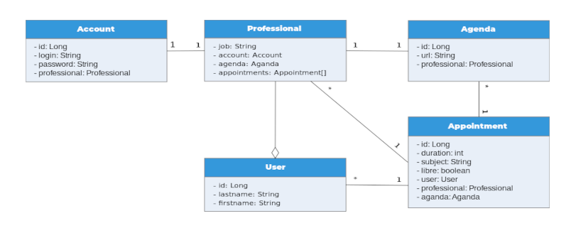

# TAA Project

## Architecture de l'API



*Diagramme des entités*

## Mis en place

### Base de donnée

Si mysql est installé sur notre machine, on l'arrête avec

```shell=
sudo service mysql stop
```

On démarre la basse de donnée avec docker

```shell=
docker run --name taabdd  -p 3306:3306 -e MYSQL_ROOT_PASSWORD=root -d mysql:latest
```

On démarre phpmyadmin avec docker

```shell=
docker run --name myadmin -d --link taabdd:db -p 8082:80 phpmyadmin
```

Après cela, rendez-vous sur http://localhost:8082/ et connectez-vous avec l'utilisateur **root** et le mot de passe **root**. Puis créez la base de donnée **taabdd**.

### Lancement de l'API

Dans le dossier *API*

```shell=
cd api/
```

Lancez la compilation du code source

```shell=
mvn compile
```

Puis lancez l'application générée

```shell=
java -jar target/projectTaa-0.0.1-SNAPSHOT.jar 
```

### Lancement du front

Dans le dossier *FRONT*

```shell=
cd front/
```

Puis lancez la version de développement

```shell=
ng serve --open
```

L'application s'ouvrira dans votre navigateur à l'adresse http://localhost:4200/

